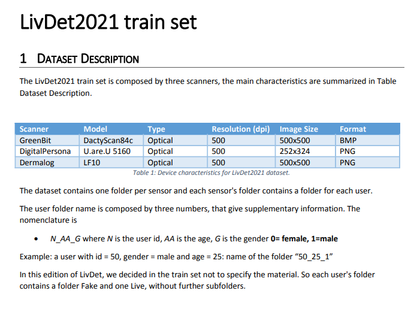

# Livdet 2021 Competitions

[\[Competition Page\]](https://livdet.org/) 

### LivDet - Liveness Detection Competitions
The goal for the Liveness Detection (LivDet) Competitions is to compare biometric liveness detection methodologies using a standardized testing protocol and large quantities of spoof and live samples. The competitions are open to all academic and industrial institutions which have a software-based or system-based biometric liveness detection solution.
   

## Train Dataset
